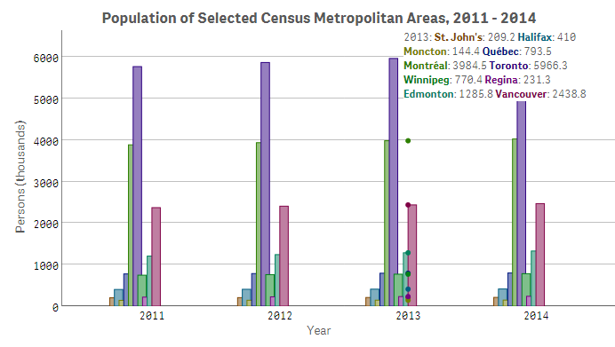
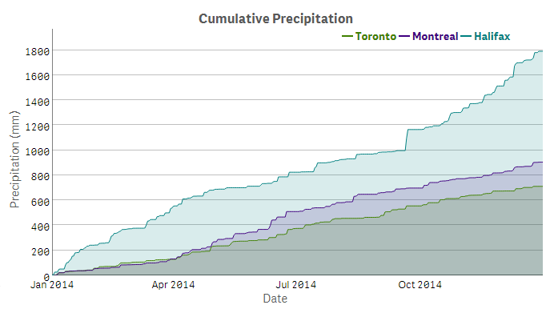
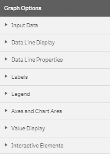
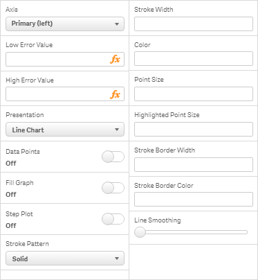

# dygraphs for Qlik Sense

Create customizable, interactive charts with Qlik Sense using the dygraphs library.

<!-- START doctoc generated TOC please keep comment here to allow auto update -->
<!-- DON'T EDIT THIS SECTION, INSTEAD RE-RUN doctoc TO UPDATE -->
## Table of Contents

- [Description](#description)
- [Screenshots](#screenshots)
- [Installation](#installation)
- [Usage](#usage)
  - [Default Interaction](#default-interaction)
  - [Graph Options](#graph-options)
    - [Input Data](#input-data)
    - [Data Line Display](#data-line-display)
    - [Data Line Properties](#data-line-properties)
    - [Labels](#labels)
    - [Legend](#legend)
    - [Axes and Chart Area](#axes-and-chart-area)
    - [Value Display](#value-display)
    - [Interactive Elements](#interactive-elements)
  - [Per-Series Options](#per-series-options)
- [License](#license)

<!-- END doctoc generated TOC please keep comment here to allow auto update -->

* * *

## Description

This visualization extension allows dygraphs charts to be integrated with Qlik Sense.&nbsp;&nbsp;It makes use of the [dygraphs](http://dygraphs.com/) JavaScript library to produce interactive, zoomable charts.&nbsp;&nbsp;The extension incorporates a selection of the dygraphs library's customization options to offer numerous possibilities for chart configuration, display and interaction.

## Screenshots

## Installation

1. Download the content.
2. Deploy the extension to your Qlik Sense environment.
   * Qlik Sense Desktop:
     Copy the entire contents of the .zip file to  
     "C:\\Users\\\<UserName\>\\Documents\\Qlik\\Sense\\Extensions\\qs-dygraphs"

   * Qlik Sense Server:
     Follow the instructions for ["Deploying visualizations in Qlik Sense"](http://help.qlik.com/sense/2.0/en-US/developer/#../Subsystems/Extensions/Content/Howtos/deploy-extensions.htm%3FTocPath%3DBuilding%2520visualization%2520extensions|Working%2520with%2520visualization%2520extensions|_____9)

3. (Optional) Import the demo app to your Qlik Sense environment.
   * Qlik Sense Desktop:
     Copy the dygraphs for Qlik Sense demo .qvf file from the demo folder to
     "C:\\Users\\\<UserName>\\Documents\\Qlik\\Sense\\Apps"

   * Qlik Sense Server:
     Follow the instructions for ["Importing apps"](http://help.qlik.com/sense/2.0/en-US/online/#../Subsystems/ManagementConsole/Content/import-apps.htm%3FTocPath%3DAdministering%2520Qlik%2520Sense%7CManaging%2520a%2520Qlik%2520Sense%2520site%7CManaging%2520QMC%2520resources%7CManaging%2520apps%7C_____1)

## Usage

1. Open a Qlik Sense app sheet, start Edit mode, then drag and drop **dygraphs** from the Charts menu onto the sheet.

2. Select the **x-Axis Data Type** and **Data Series Source** from the [Input Data](#input-data) section in Graph Options.

3. Set dimensions and measures.

4. Configure the chart using [Graph Options](#graph-options) and/or [Per-Series Options](#per-series-options).

### Default Interaction

A dygraphs chart is interactive by default.&nbsp;&nbsp;Move the mouse pointer over the chart to highlight individual values.&nbsp;&nbsp;Click and drag horizontally or vertically to zoom and Shift-click and drag to pan.&nbsp;&nbsp;Restore the initial extent of the chart by double-clicking.

* **Highlight**: mouse over

* **Zoom**: click-drag (horizontal or vertical)

* **Pan**: <kbd>Shift</kbd> + click-drag

* **Reset**: double-click

### Graph Options

Most of the configuration settings for the dygraphs chart object are found in the Graph Options menu.&nbsp;&nbsp;Here you can specify the type of input data and customize the look of the chart.

Settings in the Graph Options menu are applied globally, i.e. to all data series displayed in the dygraphs chart object.&nbsp;&nbsp;Some of these properties may be overridden by settings applied to individual data series if [Per-Series Options](#per-series-options) are enabled.&nbsp;&nbsp;To apply settings to individual data series, the [input data series source](#data-series-source) must be set to **Measures**.

The Graph Options menu consists of eight sections:
* [Input Data](#input-data)
* [Data Line Display](#data-line-display)
* [Data Line Properties](#data-line-properties)
* [Labels](#labels)
* [Legend](#legend)
* [Axes and Chart Area](#axes-and-chart-area)
* [Value Display](#value-display)
* [Interactive Elements](#interactive-elements)

The options within each section are described below.

_Graph Options_

_Graph Options &ndash; sections expanded_

#### Input Data

* **`x-Axis Data Type (Dimension 1)`** - The data type for values on the x-axis, provided by the first dimension.&nbsp;&nbsp;This may be set to either Numeric or Date.
(_default: Numeric_)

* **`Data Series Source`** - The source of data series to be displayed. (_default: Dimension 2_)  
When this is set to **Dimension 2**, a second dimension and one measure are required.&nbsp;&nbsp;The second dimension provides the set of data series to be displayed and the measure provides values for the data series.  
When this is set to **Measures**, one dimension (x-axis values) and at least one measure are required.&nbsp;&nbsp;Choose a measure for each individual data series and its values &ndash; a field or an expression may be used.&nbsp;&nbsp;Set the label property of each measure to provide a name for the data series in the chart's legend.&nbsp;&nbsp;In this mode, [per-series](#per-series-options) line display and properties settings may be applied to customize the appearance of each data series individually.

#### Data Line Display

* **`Presentation`** - How to plot each data series on the chart.&nbsp;&nbsp;This option may also be set on a [per-series](#per-series-options-measures) basis. (_default: Line Chart_)
  - **Line Chart** - Data points for each series are plotted as a line.
  - **Bar Chart** - Data points for each series are plotted as vertical bars.
  - **Multiple-Column Bar Chart** - At each x-value, data points for each series are plotted as adjacent vertical bars.
  - **Candlestick Chart** - Displays trends in price movements.&nbsp;&nbsp;Four measures are required, consisting of open, close, high and low values, respectively.

* **`Data Points`** - Draw a small dot at each data point in addition to the line that passes through.&nbsp;&nbsp;This option may also be set on a [per-series](#per-series-options) basis.
(_default: Off_)

* **`Connect Separated Data Points`** - If there are x-values for which a series is missing data, draw a continuous line for the series instead of showing gaps where values are missing.
(_default: Off_)

* **`Error Bars`** - When enabled, the **`Low Error Value`** and **`High Error Value`** expressions for a measure will be evaluated.&nbsp;&nbsp; If either **`Low Error Value`** or **`High Error Value`** is set, an error bar will be drawn for each point between this value and the series. If both **`Low Error Value`** and **`High Error Value`** are set, error bars will be drawn for each point between low and high, with the series itself going through the middle. (_default: Off_)

* **`Fill Graph`** - Fill the area underneath each data series.&nbsp;&nbsp;This option is not compatible with error bars.&nbsp;&nbsp;This option may also be set on a [per-series](#per-series-options) basis.
(_default: Off_)

* **`Stacked Graph`** - Stack series on top of one another rather than drawing them independently.&nbsp;&nbsp;Series will be stacked from top to bottom in the same order that measures are arranged in the properties panel.
(_default: Off_)

* **`Step Plot`** - Display the graph as a step plot instead of a line plot.&nbsp;&nbsp;This option may also be set on a [per-series](#per-series-options) basis.
(_default: Off_)

#### Data Line Properties

* **`Stroke Pattern`** - The pattern of the line to plot for each data series. 
(_default: Solid Line_)

* **`Stroke Width`** - The width of the line connecting data points for each series. 
(_float; default: 1.0_)

* **`Data Series Colors`** - List of colors for the data series.&nbsp;&nbsp;If not specified, equally-spaced points around a color wheel are used.&nbsp;&nbsp;A color may be listed in hexadecimal notation, rgb function notation or by keyword identifier (e.g. "#FF0000" or "rgb(255,0,0)" or "red" ).&nbsp;&nbsp;Separate colors in the list with a comma.&nbsp;&nbsp;If the Expression Editor is used to create the list, wrap the entire string in single quotation marks. 
(_string; default: see description_)

* **`Point Size`** - The size of the dot to draw on each point, in pixels, when **`Data Points`** are turned on.&nbsp;&nbsp;
This also controls the size of dots for "isolated" points, with missing data on either side, which are drawn by default.
(_integer; default: 1_)

* **`Highlighted Point Size`** - The size of the dot drawn over highlighted points, in pixels. 
(_integer; default: 3_)

* **`Stroke Border Width`** - The width of the border to draw around graph lines for data series, in pixels, to make crossing lines more easily distinguishable.&nbsp;&nbsp;Useful for graphs with many lines.
(_float; default: null_)

* **`Stroke Border Color`** - The color of the border drawn around graph lines when **`Stroke Border Width`** is set.
(_string; default: white_)

* **`Line Smoothing`** - Draw smooth lines between points using Be&#769;zier curves. This option is not compatible with Error Bars, Data Points, Fill Graph or Stacked Graph.
(_float; default: null_)

All Data Line Properties options may also be set on a [per-series](#per-series-options) basis.

#### Labels

* **`Graph Title`** - Text to display above the chart, centered.&nbsp;&nbsp;HTML character entities may be used in addition to plain text.
(_text; default: null_)

* **`Graph Title Font Size`** - Size of the font to use for the graph title, in pixels. 
(_integer; default: 20_)

* **`x-axis Title`** - Text to display below the chart's x-axis.&nbsp;&nbsp;HTML character entities may be used in addition to plain text.
(_text; default: null_)

* **`y-axis Title`** - Text to display to the left of the chart's y-axis.&nbsp;&nbsp;HTML character entities may be used in addition to plain text. (_text; default: null_)

* **`Axis Title Font Size`** - Size of the font to use for both the x-axis and y-axis titles, in pixels.
(_integer; default: 16_)

* **`Axis Label Font Size`** - Size of the font to use for both the x-axis and y-axis labels, in pixels.
(_integer; default: 14_)

#### Legend

* **`Legend Display Style`** - Show/hide and position options for legend display. 
(_default: Mouseover_)

* **`Legend Highlight Style`** - Style to use for highlighting text in the legend, for the data series closest to the mouse pointer when **`Highlight Closest Series`** is turned on.&nbsp;&nbsp;This may be set to Border, Fill or Single Series.
(_default: Border_)

* **`Legend Font Size`** - Size of the font to use for the legend text, in pixels. 
(_integer; default 14_)

* **`Stacked Legend Items`** - Place legend items on separate lines.
(_default: Off_)

#### Axes and Chart Area

* **`x-Axis Gridlines`** - Display vertical gridlines under the chart.
(_default: On_)

* **`y-Axis Gridlines`** - Display horizontal gridlines under the chart.
(_default: On_)

* **`x-Axis Padding`** - Amount of extra space around the x-axis value range to ensure points at the edges remain visible, in pixels.
(_float; default: 0_)

* **`y-Axis Padding`** - Amount of extra space around the y-axis value range to ensure points at the edges remain visible, in pixels.
(_float; default: null_)

* **`x-Axis Range (low/earliest, high/latest)`** - Explicitly set the initial horizontal range of the graph to a low and high value.&nbsp;&nbsp;
If the x-axis data consists of dates, use a date string format (e.g. "2015/08/26") for these values.&nbsp;&nbsp;Enter numbers if the x-axis data type is numeric.&nbsp;&nbsp;Separate the two values with a comma.
(_array; default: full range of input_)

* **`y-Axis Range (low, high)`** - Explicitly set the vertical range of the graph to a low and high value.&nbsp;&nbsp;Separate the two values with a comma.&nbsp;&nbsp;If either limit is unspecified, it will be calculated automatically (e.g. \[null, 30\] to automatically calculate just the lower bound).
(_array; default: full range of input_)

#### Value Display

* **`Digits Before Decimal`** - Number of digits to display before the decimal point.&nbsp;&nbsp;Numbers with more digits to the left of the decimal than this value will be displayed in scientific notation.
(_integer; default: 6_)

* **`Digits After Decimal`** - Number of digits to display after the decimal point (trailing zeros are not displayed).&nbsp;&nbsp;If a number has absolute value less than 0.1 to the power of this value, it will be displayed in scientific notation. (_integer; default: null_)

* **`Significant Digits (Scientific Mode)`** - Fixed number of significant figures to display, in scientific notation.&nbsp;&nbsp;By default, numbers are displayed with a fixed number of digits after the decimal point. (_integer; default: null_)

* **`Show K/M/B for thousands/millions/billions (base 10) on y-axis`** - Base 10 abbreviations for y-axis labels. (_default: Off_)

* **`Show K/M/G for kilo/Mega/Giga (base 2) on y-axis`** - Base 2 abbreviations for y-axis labels. (_default: Off_)

* **`UTC Date/Time Labels`** - Show date/time labels according to UTC instead of local time. (_default: Off_)

* **`Ticker and Label Format (x-axis)`** - Specify how tick marks and labels will be generated and displayed on the x-axis.&nbsp;&nbsp;When set to **Auto**, tick marks and labels will be set automatically according to the input data.&nbsp;&nbsp;When set to any of the 1:1 date options, one tick mark and label will be generated per value in the x-value range.&nbsp;&nbsp;This is particularly useful for bar charts when it is desirable to display one label per bar.&nbsp;&nbsp;However, labels will be crowded if the dataset consists of more than ten or so values, since a label is generated for each x-value.&nbsp;&nbsp;For larger datasets, this can be mitigated by setting the **`x-Axis Range`** to include a small subset of values and enabling **`Fixed Zoom`**.&nbsp;&nbsp;Turn on **`UTC Date/Time Labels`** to correct for timezone offsets if labels display incorrect values (e.g. when input dates include only the year and timezone offset is negative). 
(_default: Auto_)
  - **Auto** - Set tick marks and labels automatically.
  - **MM/DD/YYYY** - Set tick marks automatically and use 'MM/DD/YYYY' format for date labels on the x-axis and in the legend.
  - **DD/MM/YYYY** - Set tick marks automatically and use 'DD/MM/YYYY' format for date labels on the x-axis and in the legend.
  - **Year (1:1)** - Show only the year for date labels on the x-axis and in the legend.
  - **Month (1:1)** - Show only the month name for date labels on the x-axis and in the legend.
  - **Weekday (1:1)** - Show only the weekday name for date labels on the x-axis and in the legend.

#### Interactive Elements

* **`Highlight Closest Series`** - When set, the data series closest to the mouse pointer will be highlighted.&nbsp;&nbsp;Highlighted series will be rendered with thicker lines and larger data points while other series will be rendered with partial transparency.
(_default: Off_)

* **`Range Selector`** - Enable the range selector widget.&nbsp;&nbsp;This disables the default click-drag zoom interaction.
(_default: Off_)

* **`Zoom Animation`** - Animate transitions between zoom windows when interacting with the chart.
(_default: Off_)

* **`Fixed Zoom`** - Keep the zoom level fixed to the initial horizontal extent of the chart and disable zooming.&nbsp;&nbsp;Click-drag will pan instead.
(_default: Off_)

* **`Pan Edge Limit`** - A value representing the farthest a graph may be panned, relative to the display.&nbsp;&nbsp;For example, a value of 0.1 means that the graph can only be panned up to 10% beyond the edges of the displayed values. 
(_float; default: no bounds_)

### Per-Series Options

Per-Series Options allow you to configure display properties of each plotted data series individually.&nbsp;&nbsp;These options may be applied only when **`Data Series Source`** is set to **Measures**, with the exception of **`Low Error Value `** and **`High Error Value `**, as noted below.&nbsp;&nbsp;Per-series options are found in the properties section for each measure that is set.

_Per-Series Options (in Measures section)_

* **`Low Error Value`** - Used in conjunction with the **`Error Bars`** setting (see [Data Line Display](#data-line-display)).&nbsp;&nbsp;If set, an error bar will be drawn below each point in the data series between this value and the line plot for the data series.&nbsp;&nbsp;A field or an expression may be used. 
When **`Data Series Source`** is set to Dimension 2 (see [Input Data](#input-data)), an error bar will be displayed below _each_ data series provided by the second dimension. 
(_default: null_)

* **`High Error Value`** - Used in conjunction with the **`Error Bars`** setting (see [Data Line Display](#data-line-display)).&nbsp;&nbsp;If set, an error bar will be drawn above each point in the data series between this value and the line plot for the data series.&nbsp;&nbsp;A field or an expression may be used. 
When **`Data Series Source`** is set to Dimension 2 (see [Input Data](#input-data)), an error bar will be displayed above _each_ data series provided by the second dimension. 
(_default: null_)

* **`Presentation`** - How to plot the data series on the chart.
(_default: Line Chart_)
  - **Line Chart** - Data points are plotted as a line.
  - **Bar Chart** - Data points are plotted as vertical bars.

* **`Data Points`** - Draw a small dot at each data point, in addition to the line that passes through.
(_default: Off_)

* **`Fill Graph`** - Fill the area underneath the graph.
(_default: Off_)

* **`Step Plot`** - Display the data series as a step plot instead of a line plot.
(_default: Off_)

* **`Stroke Pattern`** - The pattern of the line to draw for the data series. 
(_default: Solid Line_)

* **`Stroke Width`** - The width of the line to draw for the data series.
(_float; default: 1.0_)

* **`Color`** - The color of the data series.&nbsp;&nbsp;This can be of the form "#6A5ACD" or "rgb(106,90,205)" or "slateblue".
(_string; default: null_)

* **`Point Size`** - The size of the dot to draw on each point, in pixels, when **`Data Points`** are turned on.
(_integer; default: 1_)

* **`Highlighted Point Size`** - The size of the dot to draw over a point when it is highlighted, in pixels.
(_integer; default: 3_)

* **`Stroke Border Width`** - The width of the border to draw around the line for the data series, in pixels.
(_float; default: null_)

* **`Stroke Border Color`** - The color of the border drawn around the data series line when **`Stroke Border Width`** is set.
(_string; default: white_)

* **`Line Smoothing`** - Draw a smooth line between points using Be&#769;zier curves.&nbsp;&nbsp;This option is not compatible with Error Bars, Data Points or Fill Graph. 
(_float; default: null_)

## License

Copyright &copy; 2015 Daniel Pierre

Released under the MIT license.